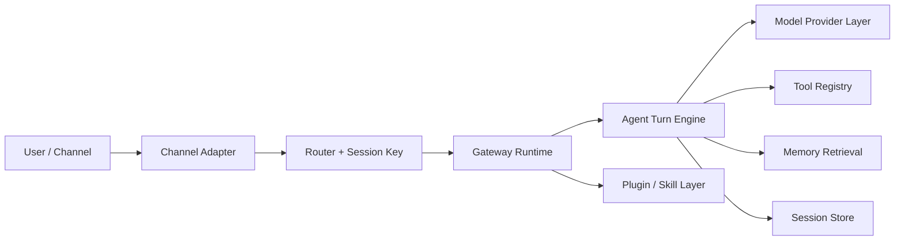

# Mini OpenClaw Rebuild

This folder is the working area for a from-scratch, portfolio-focused rebuild of OpenClaw.

The goal is not to clone every production feature. The goal is to rebuild the parts that prove real agent-system understanding:

- gateway control plane
- multi-agent routing
- session identity and persistence
- provider abstraction and fallback
- tool execution pipeline
- memory retrieval and context control
- skills/plugin extensibility

## Why this exists

The upstream repository is a production system with a very large surface area:

- many channels
- many provider/auth paths
- desktop/mobile nodes
- plugin runtime
- security and operator controls
- UI, onboarding, packaging, diagnostics, and release tooling

For interview and portfolio value, rebuilding all of that is unnecessary.

The stronger signal is:

- you understand which subsystems are the real core
- you can re-derive their abstractions
- you can ship a smaller but principled implementation

## Folder map

- `ARCHITECTURE_REVERSE_ENGINEERING.md`: my source-based analysis of the current OpenClaw architecture.
- `ROADMAP.md`: staged build plan for a smaller personal implementation.
- `CODEX_PROMPTS.md`: prompt playbook for building this with Codex/VibeCoding.
- `WORKLOG.md`: branch-local planning log and completed tasks.
- `PRACTICE_TO_BUILD_MAP.md`: maps the existing practice notes to implementation phases.
- `src/`: initial code skeleton for the rebuild.

## Target architecture



## Scope choices

Build first:

- single gateway process
- CLI plus one chat channel adapter
- one embedded agent loop
- one provider abstraction with fallback
- session store and route bindings
- tool registry with a few high-signal tools
- optional memory retrieval

Defer or simplify:

- mobile nodes
- canvas host
- 20+ channels
- full installer/onboarding UX
- deep remote ops flows
- release packaging

## Current milestone

Milestone 9 (minimal slice): roadmap phases are implemented end-to-end with small, testable modules.

Implemented roadmap slices:

- deterministic session identity + binding-based routing core
- websocket control plane + local CLI `agent.run` path
- agent turn loop with prompt/history/transcript/usage hooks
- provider fallback with retryability and cooldown
- tool runtime with audit log + initial built-in tools
- webchat adapter end-to-end flow
- memory retrieval + transcript compaction
- plugin loader + skill markdown loader
- durable JSON file session store (minimal persistence)

## Run locally

```bash
pnpm install
pnpm test
pnpm build
pnpm gateway:ws
pnpm ui:web
pnpm cli:run -- --url ws://127.0.0.1:18789 --session agent:main:main --message "hello"
```

Web demo:

- start gateway: `pnpm gateway:ws`
- start page server: `pnpm ui:web`
- open `http://127.0.0.1:4173/chat.html`
- send message and watch `agent.delta` streaming in the assistant bubble

LLM provider config (OpenAI-compatible API):

- edit `config/llm.json` with your `baseUrl`, `apiKey`, `model`
- optional local override: `config/llm.local.json` (git-ignored)
- if config is not ready, `gateway:ws` falls back to local `EchoProvider`

## Success criteria

This rebuild is successful when it can demonstrate:

1. deterministic session routing
2. streaming or incremental agent execution
3. tool calling with auditable state changes
4. model/auth fallback behavior
5. memory retrieval or transcript compaction
6. a clean extension point for future channels and tools

## Simplified vs production OpenClaw

- no mobile/desktop nodes and no large UI surface
- one channel adapter (webchat) instead of many channels
- plugin loader is local and trusted, no sandbox/security hardening
- memory is lightweight keyword+recency retrieval (not full production ranking pipeline)
- session persistence is JSON-file based, not multi-process durable storage
