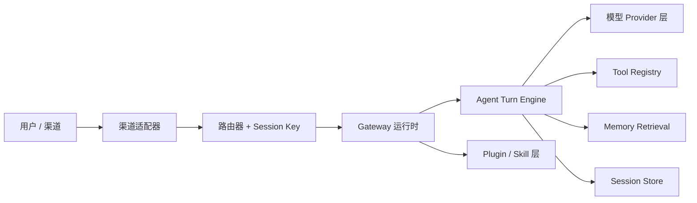

# Mini OpenClaw 重建项目

这个目录是一个从零开始、以作品集和面试表达为导向的 OpenClaw 重建工作区。

目标不是把生产版的全部功能完整复制出来，而是重建那些足以证明你真正理解 agent 系统工程的核心部分：

- gateway 控制平面
- 多 agent 路由
- session 身份与持久化
- provider 抽象与故障回退
- tool 执行流水线
- memory 检索与上下文控制
- skills / plugin 可扩展性

## 为什么要有这个目录

上游仓库是一个生产级系统，能力面非常大：

- 大量渠道接入
- 大量 provider / auth 路径
- 桌面端 / 移动端节点
- plugin 运行时
- 安全与 operator 控制
- UI、onboarding、打包、诊断与发布流程

如果目的是作品集和面试表达，没有必要把这些全部照搬。

更强的信号是：

- 你能识别哪些子系统才是真正的核心
- 你能重新推导这些核心抽象
- 你能做出一个更小但设计自洽的实现

## 目录说明

- `ARCHITECTURE_REVERSE_ENGINEERING.md`：基于源码的 OpenClaw 架构分析。
- `ROADMAP.md`：个人版精简实现的分阶段路线图。
- `CODEX_PROMPTS.md`：用 Codex / VibeCoding 构建该项目的提示词手册。
- `WORKLOG.md`：当前分支的规划记录与已完成事项。
- `PRACTICE_TO_BUILD_MAP.md`：把现有练习笔记映射到实施阶段。
- `src/`：这个重建项目的初始代码骨架。

## 目标架构

## 范围选择

优先构建：

- 单进程 gateway
- CLI 加一个聊天渠道适配器
- 一个内嵌 agent 执行循环
- 一套 provider 抽象和 fallback 机制
- session store 与 route bindings
- 一套包含少量高价值工具的 tool registry
- 可选的 memory retrieval

延后或简化：

- 移动端节点
- canvas host
- 20+ 渠道
- 完整的安装 / onboarding 体验
- 复杂的远程运维流程
- 发布打包

## 成功标准

当这个重建项目能够证明以下能力时，就算成功：

1. 确定性的 session 路由
2. 流式或增量式 agent 执行
3. 带审计能力的 tool calling
4. model / auth fallback 行为
5. memory retrieval 或 transcript compaction
6. 一个清晰的未来可扩展渠道 / 工具接入点
